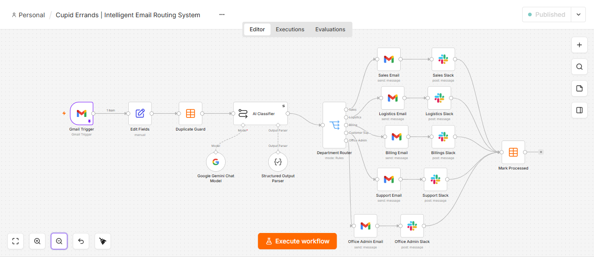
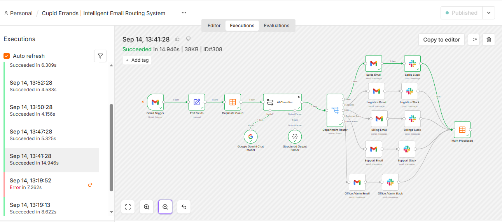
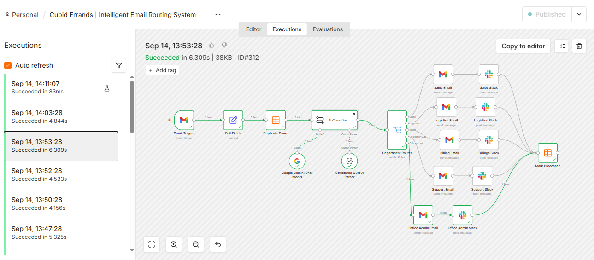
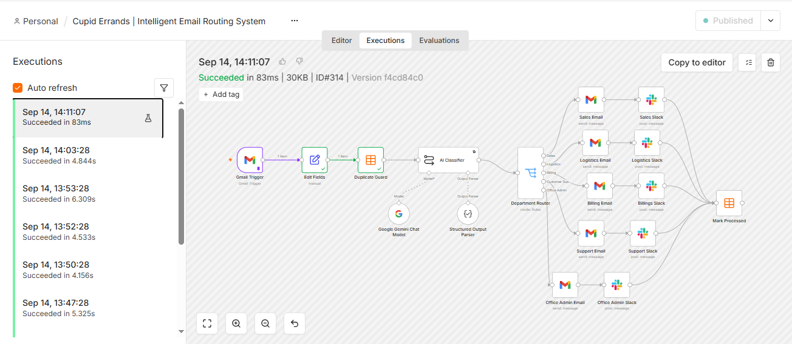
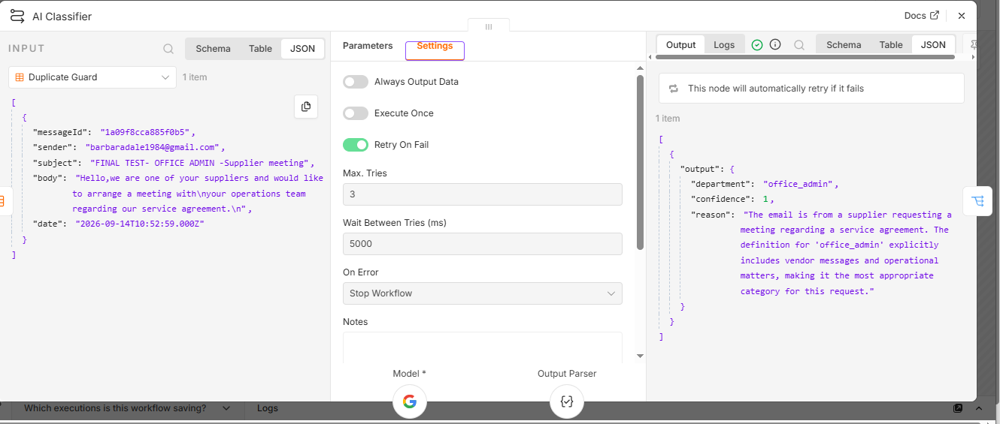
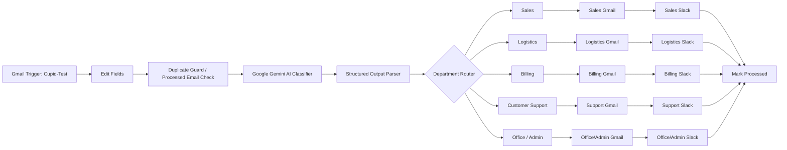

# Cupid Errands Intelligent Email Routing

**Status:** Completed AI automation portfolio system, end-to-end tested  
**Stack:** n8n, Google Gemini, Gmail, Slack, n8n Data Table / processed state, Structured Output  
**Pattern:** AI intent classification, duplicate protection, deterministic department routing, fallback handling, retry handling, processed-state tracking

## Video portfolio

**5-minute walkthrough:** [Watch the Cupid Errands demo on Tella](https://www.tella.tv/video/ai-email-routing-system-dql7)

The walkthrough covers the controlled Gmail trigger, duplicate guard, Gemini classification, structured output, deterministic routing, Gmail and Slack delivery, fallback behavior, retry handling, and duplicate-prevention proof.

## Build evidence

The screenshots below are captured from the actual n8n implementation and test executions. They are included as technical evidence rather than illustrative mockups.

### 1. Final n8n workflow

The complete workflow shows the controlled Gmail intake, field normalization, duplicate guard, Gemini classifier with structured output, deterministic Department Router, five department-specific Gmail/Slack branches, and final processed-state update.

### 2. Successful end-to-end Sales execution

A real successful execution shows the active path from Gmail intake through classification and routing into the Sales email and Slack actions before the message is marked processed. The execution history also provides evidence of repeated workflow testing.

### 3. Successful Office/Admin execution

This execution demonstrates that routing is conditional rather than hard-coded to one branch. The classified message follows the Office/Admin path, completes the department email and Slack actions, and reaches the processed-state update.

### 4. Duplicate-protection test

When an already-processed message is encountered, execution reaches the Duplicate Guard and stops there successfully. No additional model call, department delivery, Slack notification, or processed-state write is performed. This provides direct evidence of the workflow's idempotency control.

### 5. Retry and AI structured-output handling

During testing, Gemini returned a real `503 Service Unavailable` response. The workflow was hardened with Retry On Fail, configured for up to three attempts with a five-second interval. The evidence also shows successful structured classifier output after the reliability improvement.

**What this evidence demonstrates:** a complete n8n build, successful multi-route execution, deterministic downstream actions, duplicate protection, structured LLM output, and resilience against a transient external API failure.

## Business problem

A shared inbox becomes a bottleneck when staff must manually read every message, determine which department owns it, forward it, notify the right team, and avoid processing the same email twice.

This workflow automates that routing problem while keeping operational control explicit and inspectable.

## Departments

The workflow routes messages to five operational destinations:

1. Sales
2. Logistics
3. Billing
4. Customer Support
5. Office / Admin

Office / Admin also provides the default operational path when the classification cannot be mapped safely to a specialist route.

## Final workflow architecture

Detailed control architecture: [`ARCHITECTURE.md`](./ARCHITECTURE.md)

## Controlled Gmail intake

The trigger is restricted using a dedicated `Cupid-Test` Gmail label. This was added after testing showed that a broad inbox trigger allowed unrelated messages into the workflow. The label acts as an explicit test gate so only intended messages enter the automation.

## Duplicate protection

Before classification, the workflow checks the incoming Gmail message identifier against the `processed_emails` tracking table.

If the message already exists, the Duplicate Guard returns no output and execution stops before another AI call, department email, Slack notification, or processed-state write occurs.

## AI classification contract

Google Gemini interprets the email and returns structured output for downstream execution. The classification layer produces:

- `department`
- `confidence`
- `reason`

The LLM is responsible for interpreting unstructured intent. Routing remains controlled by explicit n8n workflow logic.

> **Engineering principle:** AI handles interpretation. Deterministic workflow logic controls the action.

## Deterministic routing

The Department Router maps the structured `department` value to the corresponding branch. This keeps the execution path transparent even though AI is used upstream for interpretation.

Each branch performs department-specific Gmail delivery and Slack notification before the workflow updates its processed state.

## Verified end-to-end testing

The following tests were completed successfully:

| Test | Result |
| --- | --- |
| Sales request | Routed only to Sales email + Sales Slack, then marked processed |
| Logistics request | Routed only to Logistics email + Logistics Slack, then marked processed |
| Billing request | Routed only to Billing email + Billing Slack, then marked processed |
| Customer Support request | Routed only to Customer Support email + Support Slack, then marked processed |
| Office/Admin request | Routed only to Office/Admin email + Office/Admin Slack, then marked processed |
| Ambiguous request | Fell back to Office/Admin as designed |
| Duplicate message ID | Duplicate Guard returned no output and stopped downstream execution |

## Retry handling

During testing, Google Gemini returned a temporary `503 Service Unavailable` response caused by high demand. Retry-on-fail was added with three attempts and a five-second delay between attempts so a transient provider failure does not immediately terminate the workflow.

The failed execution was not marked as processed, and a later run completed successfully.

## Delivery and state tracking

Each successful route triggers:

- department-specific Gmail delivery
- department-specific Slack notification
- final processed-state update

The processed table stores operational metadata such as message ID, department, processed time, sender, subject, and status.

## Engineering decisions

- AI is used for unstructured email interpretation, not uncontrolled execution.
- Controlled Gmail intake prevents unrelated inbox traffic from entering the workflow.
- Duplicate protection occurs before repeated downstream actions and before another model call.
- Structured output creates a machine-readable boundary between AI interpretation and workflow routing.
- Department execution is deterministic and inspectable.
- Office / Admin provides an operational fallback path.
- Retry handling addresses transient external-model failures.
- Processed-state tracking supports traceability and prevents repeat handling.

## Public evidence

Public evidence consists of the raw n8n implementation screenshots above, the video walkthrough, documented architecture, verified test outcomes, and selected implementation details. Credentials, API keys, personal test addresses, Slack identifiers, and other private configuration are intentionally excluded.

## Skills demonstrated

- n8n workflow orchestration
- Google Gemini integration
- AI intent classification
- structured-output design
- JSON handling
- deduplication and idempotency
- deterministic routing
- Gmail and Slack integrations
- fallback design
- retry handling
- operational state tracking
- end-to-end test design
